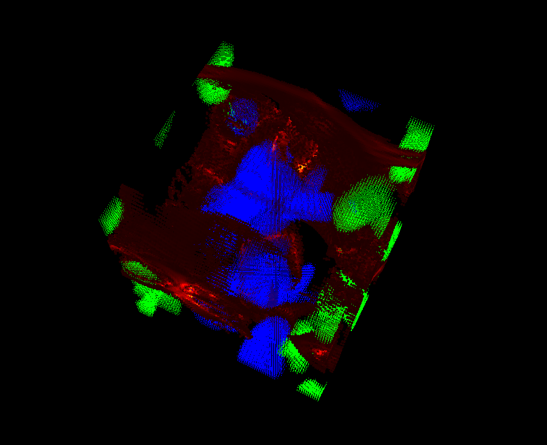
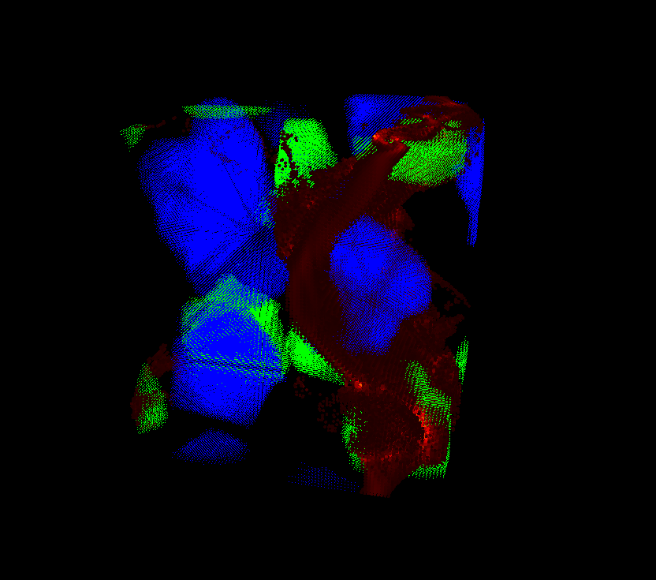
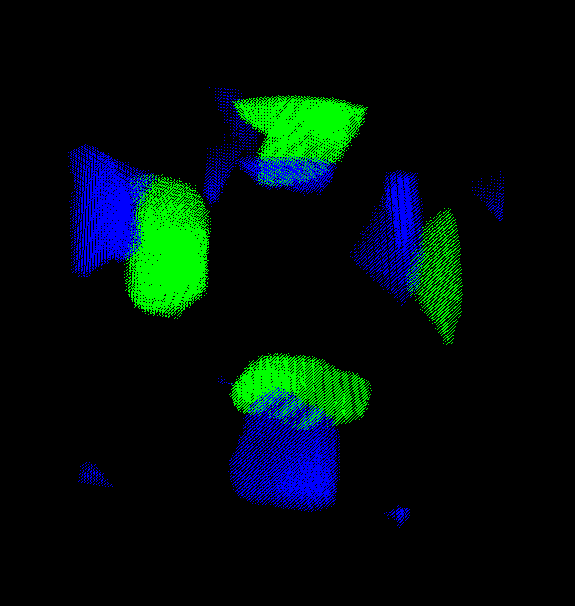

## Introduction

This repository includes python files to: 
  * generate a dataset of 3D voxel microstructures and compute mechanical response ([FileManager.py](FileManager.py), [generate_db_micro.py](generate_db_micro.py)).
  * 3D plotting the microstructures, leveraging the GPU with [vispy](https://vispy.org/) ([plot_2_micro_lines.py](plot_2_micro_lines.py), [plot_2_shapes_microstructure.py](plot_2_shapes_microstructure.py))
  * predicting the mechanical response with supervised learning ([linear regression](linear_regression.ipynb), [MLP](MLP_prototype.ipynb))

The framework and the theory around this research subject are actually very well defined and I will add a presentation in the coming months.

The mechanical response is computed with François Willot's morphhom Fortran code. You need morphhom to compute the mechanical response. Contact François Willot if you wish to make the mechanical computations.

This work has been done during my research internship at the [Centre for Mathematical Morphology (CMM)](https://www.cmm.minesparis.psl.eu/en/home/), in collaboration with [Université Gustave Eiffel](https://www.univ-gustave-eiffel.fr/). To this date the internship is ongoing and this repository is still under development. A scientific publication is currently under preparation.

## Generating 3D microstructures

Here is a screenshot of the kind of voxel microstructures that I generate, with inclusions in green and blue, and the deformation localization surfaces in red:

